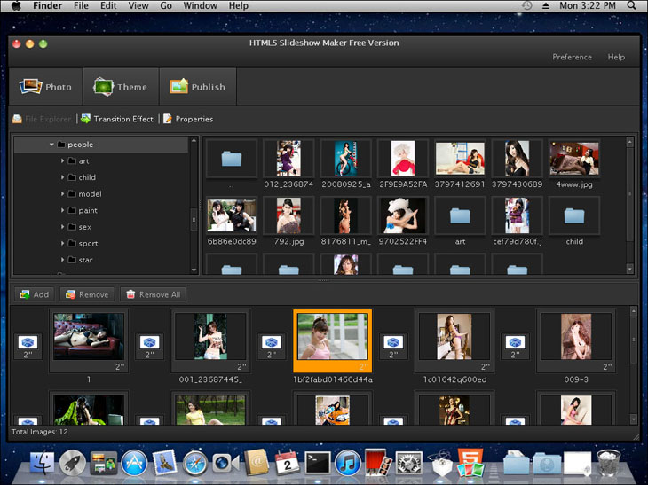

# [HTML5 Slideshow Maker Free](http://jackzhang1204.github.io/) #

## 概述 ##
HTML5 Slideshow Maker Free是一个将图片简单快捷转成HTML5相册的小型免费应用软件。该软件采用Adobe AIR技术开发，实现了一次开发同时发布到windows, Mac等多平台。

1. AIR版安装下载地址：[http://pan.baidu.com/s/1mgqTvhm](http://pan.baidu.com/s/1mgqTvhm)
2. EXE版安装下载地址：[http://pan.baidu.com/s/1sjwiOWH](http://pan.baidu.com/s/1sjwiOWH)

## Author: ##
* Jack's GitHub 	[https://github.com/jackzhang1204](https://github.com/jackzhang1204)
* Jack's Twitter 	[https://twitter.com/jackzhang1204](https://twitter.com/jackzhang1204)
* Jack's Facebook 	[https://www.facebook.com/jackzhang1204](https://www.facebook.com/jackzhang1204)
* Jack's Google+ 	[https://plus.google.com/+JackZhang1204](https://plus.google.com/+JackZhang1204)
* Jack's Gmail 		[jackzhang1204@gmail.com](http://www.gmail.com)
